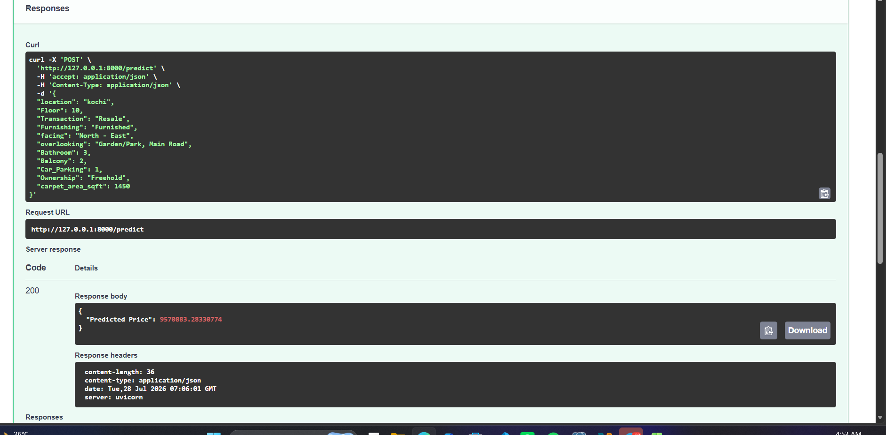

# 🏠 House Price Prediction API

A Machine Learning API that predicts house prices using property features. The final model was trained using **Scikit-learn** and deployed using **FastAPI**.

---

# 📌 Project Overview

This project predicts house prices based on the following property features:

- Location
- Floor
- Transaction
- Furnishing
- Facing
- Overlooking
- Bathroom
- Balcony
- Car Parking
- Ownership
- Carpet Area (sqft)

The final deployed model is a **Random Forest Regressor** wrapped inside a **Scikit-learn Pipeline**.

---

# 🛠 Technologies Used

- Python
- Pandas
- NumPy
- Scikit-learn
- FastAPI
- Joblib
- Uvicorn

---

# 🤖 Machine Learning Models

Models trained:

- Linear Regression
- Random Forest Regressor

Random Forest achieved the best performance and was selected as the final model.

---

# 📊 Model Performance

| Model | R² Score |
|--------|----------|
| Linear Regression | 0.14 |
| Random Forest Regressor | 0.17 |

---

# 📂 Project Structure

```text
HousePriceAPI
│
├── images/
│   ├── api_predict.png
│   ├── api_response.png
│   ├── actual_vs_predicted.png
│   └── feature_importance.png
│
├── app.py
├── Final_Proj.ipynb
├── README.md
├── requirements.txt
├── house_price_random_forest.pkl
└── .gitignore
```

> The original dataset is not included because it exceeds GitHub's size limit.

---

# ⚙️ Installation

Clone the repository

```bash
git clone https://github.com/shahinazsalah/HousePriceAPI.git
```

Install dependencies

```bash
pip install -r requirements.txt
```

---

# ▶️ Run the API

```bash
uvicorn app:app --reload
```

---

# 🚀 API Endpoints

## Home

```
GET /
```

Response

```json
{
  "message": "House Price Prediction API is Running!"
}
```

---

## Model Status

```
GET /model
```

Response

```json
{
  "status": "Random Forest Model Loaded Successfully"
}
```

---

## Predict

```
POST /predict
```

Example Request

```json
{
  "location": "kochi",
  "Floor": 10,
  "Transaction": "Resale",
  "Furnishing": "Furnished",
  "facing": "North - East",
  "overlooking": "Garden/Park, Main Road",
  "Bathroom": 3,
  "Balcony": 2,
  "Car_Parking": 1,
  "Ownership": "Freehold",
  "carpet_area_sqft": 1450
}
```

Example Response

```json
{
  "Predicted Price": 9570883.28
}
```

---

# 🌍 Live Demo

### API

https://housepriceapi-production-ecc5.up.railway.app

### Swagger UI

https://housepriceapi-production-ecc5.up.railway.app/docs

### ReDoc

https://housepriceapi-production-ecc5.up.railway.app/redoc

---

# 📖 API Documentation

### Local

```
http://127.0.0.1:8000/docs
```

### Live

```
https://housepriceapi-production-ecc5.up.railway.app/docs
```

---

# 📸 Screenshots

### Swagger - Prediction Request


### Swagger - Prediction Response



### Actual vs Predicted Prices


### Top 15 Feature Importance


---

# 👩‍💻 Author

**Shahinaz Salah**

Data Science & AI Student

GitHub Repository:

https://github.com/shahinazsalah/HousePriceAPI