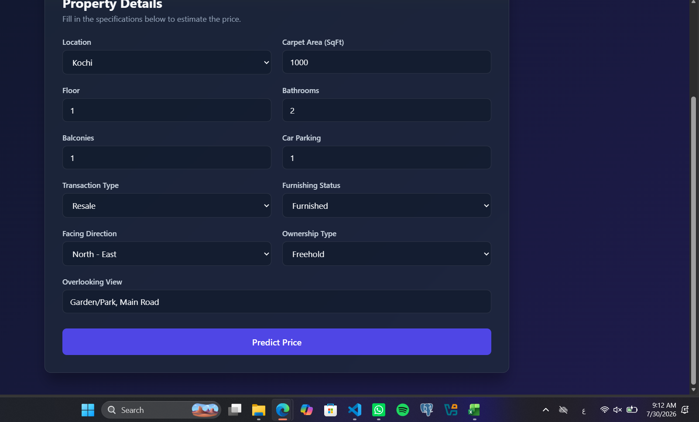
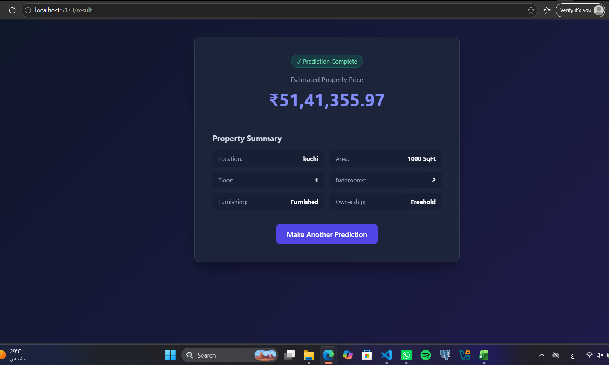
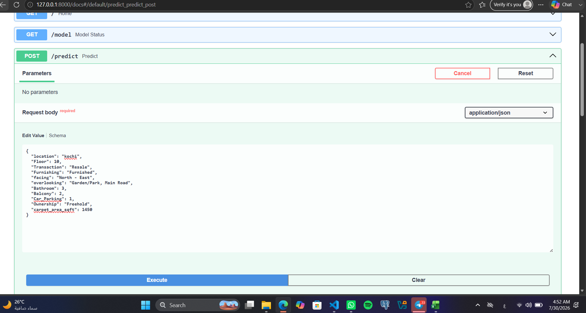
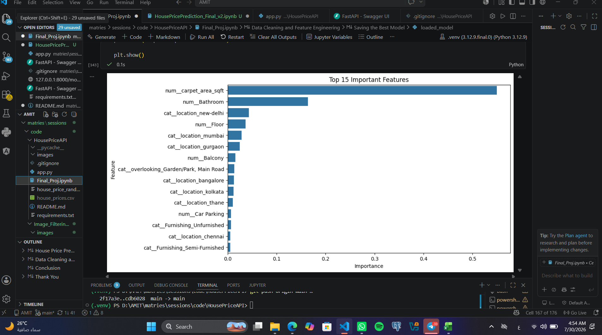

# 🏠 House Price Prediction - Full-Stack Web Application

A full-stack Machine Learning web application that allows users to enter house information through a React interface, sends the data to a deployed FastAPI backend, and displays the predicted house price generated by a trained Random Forest model. The system features a **React + TypeScript** frontend and a **FastAPI** backend powered by a **Random Forest Regressor** model deployed on **Railway**.

---

# 📌 Project Overview

This project provides an end-to-end platform for real estate price estimation based on the following property features:

- Location
- Carpet Area (sqft)
- Floor Number
- Bathrooms
- Balconies
- Car Parking
- Transaction Type
- Furnishing Status
- Facing Direction
- Ownership Type
- Overlooking View

The backend processes these features through a trained **Scikit-learn Pipeline** and returns an estimated property price instantly.

---

# 🌐 Live Demo

### Backend API

https://housepriceapi-production-ecc5.up.railway.app

### Swagger Documentation

https://housepriceapi-production-ecc5.up.railway.app/docs

### ReDoc Documentation

https://housepriceapi-production-ecc5.up.railway.app/redoc

---
# 🔄 Application Workflow

The application follows a complete end-to-end workflow:

1. The user enters the property details through the **React Frontend**.
2. The frontend sends a **POST** request to the deployed **FastAPI** backend using **Axios**.
3. The backend preprocesses the input and passes it to the trained **Random Forest Pipeline**.
4. The model predicts the house price.
5. The backend returns the prediction as a JSON response.
6. The frontend receives the response and displays the predicted house price instantly.

```text
React Frontend
      │
      │  POST /predict
      ▼
FastAPI Backend
      │
      ▼
Random Forest Model
      │
      ▼
Predicted Price
      │
      ▼
Displayed in React UI
```

# 🛠 Technologies Used

## Frontend

- React
- TypeScript
- Vite
- React Router DOM
- Axios (REST API Communication)
- CSS3

## Backend

- Python
- FastAPI
- Pandas
- NumPy
- Scikit-learn
- Joblib
- Uvicorn

## Deployment

- Railway

---

# 🤖 Machine Learning Models

The following models were trained and evaluated:

| Model | R² Score |
|------|------:|
| Linear Regression | 0.14 |
| **Random Forest Regressor** | **0.17** |

The **Random Forest Regressor** achieved the highest performance and was selected as the final deployed model.

---

# 📂 Project Structure

```text
HousePriceAPI
│
├── frontend/
│   ├── src/
│   │   ├── api/
│   │   ├── components/
│   │   ├── pages/
│   │   ├── types/
│   │   ├── App.tsx
│   │   ├── main.tsx
│   │   └── App.css
│   ├── package.json
│   └── vite.config.ts
│
├── images/
│   ├── ui_form.png
│   ├── ui_result.png
│   ├── api_predict.png
│   ├── actual_vs_predicted.png
│   └── feature_importance.png
│
├── app.py
├── Final_Proj.ipynb
├── house_price_random_forest.pkl
├── requirements.txt
├── README.md
└── .gitignore
```

---

# ⚙️ Installation

## 1. Clone Repository

```bash
git clone https://github.com/shahinazsalah/HousePriceAPI.git
cd HousePriceAPI
```

---

## 2. Backend Setup

Create a virtual environment

```bash
python -m venv .venv
```

Activate it

### Windows

```bash
.venv\Scripts\activate
```

### Linux / macOS

```bash
source .venv/bin/activate
```

Install dependencies

```bash
pip install -r requirements.txt
```

Run FastAPI

```bash
uvicorn app:app --reload
```

Backend runs at:

```
http://127.0.0.1:8000
```

---

## 3. Frontend Setup

Navigate to frontend

```bash
cd frontend
```

Install dependencies

```bash
npm install
```

Run React application

```bash
npm run dev
```

Frontend runs at

```
http://localhost:5173
```

---

# 🚀 API Endpoints

## Home

```
GET /
```

Response

```json
{
  "message": "House Price Prediction API is Running!"
}
```

---

## Model Status

```
GET /model
```

Response

```json
{
  "status": "Random Forest Model Loaded Successfully"
}
```

---

## Predict

```
POST /predict
```

### Example Request

```json
{
  "location": "kochi",
  "Floor": 10,
  "Transaction": "Resale",
  "Furnishing": "Furnished",
  "facing": "North - East",
  "overlooking": "Garden/Park, Main Road",
  "Bathroom": 3,
  "Balcony": 2,
  "Car_Parking": 1,
  "Ownership": "Freehold",
  "carpet_area_sqft": 1450
}
```

### Example Response

```json
{
  "Predicted Price": 8350154.90
}
```

---

# 📸 Screenshots

## React User Interface

### Property Details Form



### Prediction Result



---

## FastAPI

### Swagger Request



---

## Machine Learning

### Actual vs Predicted


### Feature Importance



---

# 👩‍💻 Author

**Shahinaz Salah**

Data Science & AI Student

GitHub:

https://github.com/shahinazsalah

---

# 📌 Project Submission

This repository represents the individual submission of **Shahinaz Salah** for the House Price Prediction course project.

The project includes:

- Data Cleaning & Preprocessing
- Machine Learning Model Training
- Model Evaluation
- FastAPI Backend
- React Frontend
- Railway Deployment
- GitHub Documentation

## ✨ Features

- Modern React User Interface
- Responsive Design
- Form Validation
- REST API Integration using Axios
- Live Prediction from Railway Deployment
- FastAPI Interactive Documentation (Swagger)
- Machine Learning Pipeline using Random Forest
- End-to-End Full Stack Architecture